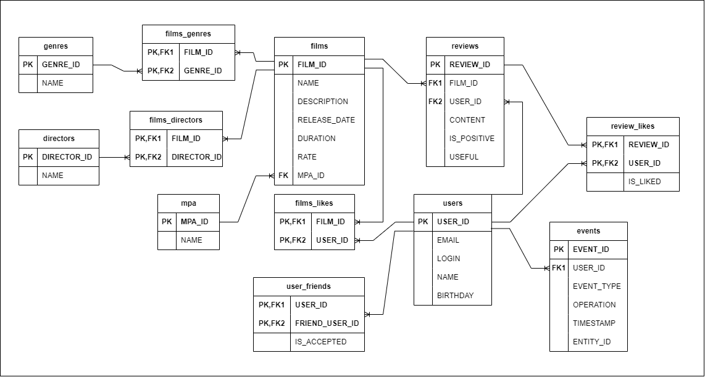

# Приложение Filmorate
Основная функциональность:
- добавление, обновление, удаление фильма и получение списка всех фильмов;
- добавление, обновление, удаление пользователя и получение списка всех пользователей. Также возможность 
пользователям добавлять друг друга в друзья и ставить фильмам лайки;
- получение списка жанров и рейтингов MPA и по идентификатору;
- пользователи могут оставлять отзывы к фильмам, редактировать, удалять и оценить их;
- пользователь может искать фильмы по названию и(или) по режиссёру;
- вывод общих с другом фильмов с сортировкой по их популярности;
- пользователь может запросить рекомендации по фильмам для просмотра;
- возможность просмотра последних событий пользователя на платформе;
- добавление, обновление, удаление режиссеров, получение по идентификатору или списком;
- возможность выводить топ-N фильмов по количеству лайков, с опцией указанного жанра за нужный год;

# Схема базы данных:

Описание: основные сущности users, films, mpa, genres,directors, reviews, events описывают пользователей, фильмы,
мпа-рейтинги, жанры фильмов, режиссеров, отзывы и ленту событий, соответственно. Вспомогательные сущности:
для связи фильмов и жанров - films_genres, для связи лайков фильмам от пользователей - films_likes,
для определения дружбы между пользователями - user_friends, для связи фильмов и режиссеров - films_directors, для связи
лайков отзывам от пользователей - review_likes.

Основные запросы для базы данных:
Получения списка пользователей:

SELECT * FROM "users" u;

Получение пользователя по id:

SELECT * FROM "users" u WHERE USER_ID = id;

Добавление в друзья:

INSERT INTO "user_friends" (USER_ID, FRIEND_USER_ID) VALUES (?, ?)

Подтверждение дружбы:

INSERT INTO "user_friends" (USER_ID, FRIEND_USER_ID, IS_ACCEPTED) VALUES (?, ?, TRUE);

UPDATE "user_friends" SET IS_ACCEPTED = TRUE WHERE USER_ID = ? AND FRIEND_USER_ID = ?;

Удаление друга:

DELETE FROM "user_friends"  WHERE USER_ID  = ? AND FRIEND_USER_ID = ?

Получение списка друзей пользователя по id: 

SELECT u.USER_ID, u.EMAIL, u.LOGIN, u.NAME, u.BIRTHDAY FROM "user_friends" AS uf
INNER JOIN "users" u ON uf.FRIEND_USER_ID = u.USER_ID
WHERE uf.USER_ID = id ORDER BY u.USER_ID ASC;

Получение списка фильмов:

SELECT * FROM "films";

Получение фильма по id:

SELECT * FROM "films" f WHERE FILM_ID = id;

Получение списка жанров фильма по id:

SELECT fg.GENRE_ID, g.NAME  FROM "films_genres" fg
INNER JOIN "genres" g ON g.GENRE_ID = fg.GENRE_ID
WHERE FILM_ID = id;

Получение название mpa-рейтинга фильма по id:

SELECT m.NAME FROM "mpa" m
INNER JOIN "films" f ON m.MPA_ID = f.MPA_ID
WHERE f.FILM_ID = 1

Добавление лайка фильму:

INSERT INTO "film_likes" (FILM_ID, USER_ID) VALUES (?,?);
UPDATE "films" SET RATE = ((SELECT RATE FROM "films" f WHERE FILM_ID = ?) + 1) WHERE FILM_ID = ?;

Удаление лайка фильму:

DELETE FROM "film_likes" WHERE FILM_ID = ? AND USER_ID = ?;
UPDATE "films" SET RATE = ((SELECT RATE FROM "films" f WHERE FILM_ID = ?) - 1) WHERE FILM_ID = ?;

Получение первых count списка популярных фильмов: 

SELECT * FROM "films" f ORDER BY RATE DESC LIMIT count;

Получение первых count списка популярных фильмов, заданного жанра и(или) года выпуска:

SELECT * FROM "films" f 
JOIN "films_genres" fg ON f.FILM_ID = fg.FILM_ID
WHERE fg.GENRE_ID = (SELECT COALESCE(?, fg.GENRE_ID))
AND EXTRACT(YEAR FROM CAST(f.RELEASE_DATE AS date)) 
= (SELECT COALESCE(?, EXTRACT(YEAR FROM CAST(f.RELEASE_DATE AS date))))
ORDER BY RATE DESC LIMIT count;

Добавление отзыв пользователя фильму:

INSERT INTO "reviews" (CONTENT, IS_POSITIVE, USER_ID, FILM_ID) VALUES (?,?,?,?);

Поиск фильма по названию и режиссеру:

SELECT  DISTINCT f.FILM_ID , f.NAME , f.DESCRIPTION , f.RELEASE_DATE , f.DURATION , f.RATE , f.MPA_ID FROM "films" f
left JOIN "films_directors" t ON f.FILM_ID = t.FILM_ID
left JOIN "directors" d ON t.DIRECTOR_ID  = d.DIRECTOR_ID
where lower(d.NAME) like ? or lower(f.NAME) like ? Order by f.FILM_ID DESC;

Добавление события пользователя:

INSERT INTO "events" (USER_ID, EVENT_TYPE, OPERATION, TIMESTAMP, ENTITY_ID) VALUES (?,?,?,?,?);